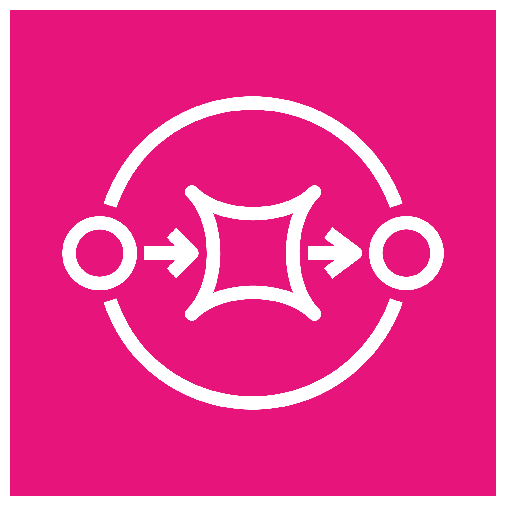

### **Amazon EventBridge**

   
  

**Modelo:** PaaS
**Híbrido:** ✅
**Totalmente gerenciado pela AWS:** ✅
**Sem servidor:** ✅
**Escopo:** Regional
**Opera:** Layer 7 – Roteamento de eventos entre aplicações e serviços
**Shared Model:**
 🔹 AWS gerencia a infraestrutura e escalabilidade
 🔹 Você cria regras, define eventos e destinos

**Características:** Event bus, integração entre apps, automatização de workflows

**Palavras-chave:** Event-driven, eventos, integração, serverless

**Exemplo:** É como um carteiro que entrega mensagens importantes para várias casas (serviços) automaticamente.

📝 **Como cai na prova:**
 🔹 “Você precisa conectar serviços por eventos...”
 🔹 “Qual serviço roteia eventos entre sistemas?”

💰 **Como é cobrado:**
 🔹 Por número de eventos publicados e entregues

---

### **Amazon Simple Notification Service (SNS)**

   
  

**Modelo:** PaaS
**Híbrido:** ✅
**Totalmente gerenciado pela AWS:** ✅
**Sem servidor:** ✅
**Escopo:** Regional
**Opera:** Layer 7 – Publicação e assinatura de mensagens (pub/sub)
**Shared Model:**
 🔹 AWS cuida da infra e da entrega das mensagens
 🔹 Você gerencia tópicos e assinantes

**Características:** Envio de notificações em tempo real, pub/sub, múltiplos protocolos (SMS, email, HTTP)

**Palavras-chave:** Notificação, pub/sub, fanout, mensagens

**Exemplo:** É como um alto-falante que anuncia mensagens para várias pessoas ao mesmo tempo.

📝 **Como cai na prova:**
 🔹 “Você precisa enviar mensagens para múltiplos destinatários...”
 🔹 “Qual serviço usa pub/sub para notificações?”

💰 **Como é cobrado:**
 🔹 Por número de solicitações e volume de mensagens enviadas

---

### **Amazon Simple Queue Service (SQS)**

   
  

**Modelo:** PaaS
**Híbrido:** ✅
**Totalmente gerenciado pela AWS:** ✅
**Sem servidor:** ✅
**Escopo:** Regional
**Opera:** Layer 7 – Fila de mensagens para desacoplamento de sistemas
**Shared Model:**
 🔹 AWS gerencia a fila, entrega e durabilidade
 🔹 Você gerencia o consumo e processamento das mensagens

**Características:** Mensageria confiável, desacoplamento, suporte a filas padrão e FIFO

**Palavras-chave:** Fila, mensageria, desacoplamento, garantido

**Exemplo:** É como uma fila na loja onde as mensagens esperam a vez para serem atendidas.

📝 **Como cai na prova:**
 🔹 “Você precisa desacoplar sistemas usando fila de mensagens...”
 🔹 “Qual serviço oferece filas gerenciadas?”

💰 **Como é cobrado:**
 🔹 Por número de solicitações e volume de mensagens

---

### **AWS Step Functions**

   
  

**Modelo:** PaaS
**Híbrido:** ✅
**Totalmente gerenciado pela AWS:** ✅
**Sem servidor:** ✅
**Escopo:** Regional
**Opera:** Nível de aplicação – Orquestração de workflows e estados
**Shared Model:**
 🔹 AWS gerencia a execução dos estados e escalabilidade
 🔹 Você define os passos e lógica do workflow

**Características:** Coordena múltiplos serviços, visual workflow, retry automático

**Palavras-chave:** Orquestração, workflows, serverless, estado

**Exemplo:** É como um diretor de teatro que orienta atores (serviços) para agir na ordem certa.

📝 **Como cai na prova:**
 🔹 “Você precisa coordenar vários serviços em um fluxo de trabalho...”
 🔹 “Qual serviço orquestra processos serverless?”

💰 **Como é cobrado:**
 🔹 Por transição de estado executada
