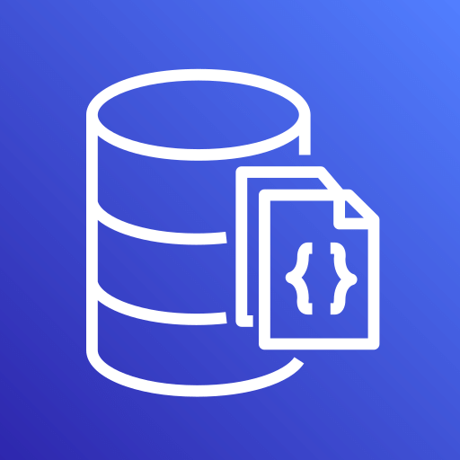

  <h3>Amazon Aurora</h3>
   

 

[Documentação](https://aws.amazon.com/pt/rds/aurora/)

Amazon Aurora is a global-scale relational database service built for the cloud with full MySQL and PostgreSQL compatibility.

- **Modelo:** PaaS
- **Híbrido:** ✅
- **Totalmente gerenciado pela AWS:** ✅
- **Sem servidor:** ❌ (tem modo serverless opcional)
- **Escopo:** Regional
- **Opera:** Layer 7 – Banco de dados relacional (compatível com MySQL/PostgreSQL)
- **Shared Model:**
  -  🔹 AWS gerencia infraestrutura, backups, replicação
  -  🔹 Você gerencia dados, esquemas e segurança
- **Características:** Alta performance, escalabilidade, compatível SQL
- **Palavras-chave:** Relacional, MySQL, PostgreSQL, alta disponibilidade
- **Exemplo:** É como um banco de dados turbo que entende as mesmas linguagens do MySQL e PostgreSQL.
- 📝 **Como cai na prova:**
  -  🔹 “Precisa de banco relacional rápido e gerenciado...”
  -  🔹 “Qual serviço AWS é compatível com MySQL e PostgreSQL?”
- 💰 **Como é cobrado:**
  -  🔹 Por instância, armazenamento e I/O utilizados

---

  <h3>Amazon DocumentDB</h3>
   

 

[Documentação](https://aws.amazon.com/pt/documentdb/)

Amazon DocumentDB (with MongoDB compatibility) is a fast, reliable, and fully managed database service that makes it easy for you to set up, operate, and scale MongoDB-compatible databases.

- **Modelo:** PaaS
- **Híbrido:** ✅
- **Totalmente gerenciado pela AWS:** ✅
- **Sem servidor:** ❌
- **Escopo:** Regional
- **Opera:** Layer 7 – Banco NoSQL baseado em documentos (compatível MongoDB)
- **Shared Model:**
  -  🔹 AWS gerencia a infraestrutura e replicação
  -  🔹 Você gerencia dados e segurança
- **Características:** Banco de documentos, alta escalabilidade, compatível MongoDB
- **Palavras-chave:** NoSQL, documentos, MongoDB, escalável
- **Exemplo:** É como um caderno digital que guarda informações no formato de documentos, rápido e fácil de acessar.
- 📝 **Como cai na prova:**
  -  🔹 “Precisa de banco NoSQL para documentos JSON...”
  -  🔹 “Qual serviço é compatível com MongoDB gerenciado?”
- 💰 **Como é cobrado:**
  -  🔹 Por instância, armazenamento e I/O usados

---

  <h3>Amazon DynamoDB</h3>
   

 

[Documentação](https://aws.amazon.com/pt/dynamodb/)

Amazon DynamoDB is a fully managed, serverless, key-value NoSQL database that runs high-performance applications at any scale, with built-in security, continuous backups, and automated multi-region replication.

- **Modelo:** PaaS
- **Híbrido:** ✅
- **Totalmente gerenciado pela AWS:** ✅
- **Sem servidor:** ✅
- **Escopo:** Regional
- **Opera:** Layer 7 – Banco NoSQL chave-valor e documento
- **Shared Model:**
  -  🔹 AWS gerencia tudo: infraestrutura, replicação, escalabilidade
  -  🔹 Você gerencia tabelas, dados e permissões
- **Características:** Ultra rápido, escalável, sem servidor, baixa latência
- **Palavras-chave:** NoSQL, serverless, chave-valor, alta performance
- **Exemplo:** É como um armário mágico que guarda e acha suas coisas num piscar de olhos, sem precisar se preocupar com servidor.
- 📝 **Como cai na prova:**
  -  🔹 “Quer banco NoSQL serverless com alta performance...”
  -  🔹 “Qual serviço oferece banco chave-valor totalmente gerenciado?”
- 💰 **Como é cobrado:**
  -  🔹 Por capacidade provisionada (RCU/WCU) e armazenamento

---

  <h3>Amazon ElastiCache</h3>
   

 

[Documentação](https://aws.amazon.com/pt/elasticache/)

Amazon ElastiCache is a fully managed Redis- and Memcached-compatible service delivering real-time, cost-optimized performance for modern applications with 99.99% availability.

- **Modelo:** PaaS
- **Híbrido:** ✅
- **Totalmente gerenciado pela AWS:** ✅
- **Sem servidor:** ❌
- **Escopo:** Regional
- **Opera:** Layer 7 – Cache em memória para acelerar aplicações
- **Shared Model:**
  -  🔹 AWS gerencia infraestrutura, replicação e failover
  -  🔹 Você gerencia dados em cache e permissões
- **Características:** Cache rápido, suporta Redis e Memcached
- **Palavras-chave:** Cache, in-memory, performance, Redis
- **Exemplo:** É como uma memória rápida extra para o seu computador, que ajuda o site a responder mais rápido.
- 📝 **Como cai na prova:**
  -  🔹 “Quer melhorar a performance usando cache em memória...”
  -  🔹 “Qual serviço oferece cache Redis gerenciado?”
- 💰 **Como é cobrado:**
  -  🔹 Por instância e tempo usado

---

  <h3>Amazon Neptune</h3>
   

 

[Documentação](https://aws.amazon.com/pt/neptune/)

Amazon Neptune is a fast, fully managed database service powering graph use cases such as identity graphs, knowledge graphs, and fraud detection.

- **Modelo:** PaaS
- **Híbrido:** ✅
- **Totalmente gerenciado pela AWS:** ✅
- **Sem servidor:** ❌
- **Escopo:** Regional
- **Opera:** Layer 7 – Banco de grafos para dados altamente conectados
- **Shared Model:**
  -  🔹 AWS gerencia infraestrutura e backups
  -  🔹 Você gerencia dados e consultas
- **Características:** Banco de grafos, consultas complexas em grafos, alta disponibilidade
- **Palavras-chave:** Grafo, dados conectados, consultas complexas
- **Exemplo:** É como um mapa onde você pode ligar pontos e ver todas as conexões entre eles.
- 📝 **Como cai na prova:**
  -  🔹 “Quer banco para dados que têm muitas conexões...”
  -  🔹 “Qual serviço é banco de grafos gerenciado?”
- 💰 **Como é cobrado:**
  -  🔹 Por instância, armazenamento e I/O

---

  <h3>Amazon RDS</h3>
   

 

[Documentação](https://aws.amazon.com/pt/rds/)

Amazon Relational Database Service (RDS) is a fully managed, open-source cloud database service that allows you to easily operate and scale your relational database of choice, including Amazon Aurora, PostgreSQL, SQL Server, and MySQL.

- **Modelo:** PaaS
- **Híbrido:** ✅
- **Totalmente gerenciado pela AWS:** ✅
- **Sem servidor:** ❌ (tem modo serverless opcional)
- **Escopo:** Regional
- **Opera:** Layer 7 – Banco relacional gerenciado (MySQL, PostgreSQL, SQL Server, etc)
- **Shared Model:**
  -  🔹 AWS gerencia infraestrutura, backups, patches
  -  🔹 Você gerencia dados e segurança
- **Características:** Fácil uso, escalável, backups automáticos
- **Palavras-chave:** Relacional, SQL, gerenciado, banco de dados
- **Exemplo:** É como um banco de dados tradicional que a AWS cuida para você não precisar se preocupar com manutenção.
- 📝 **Como cai na prova:**
  -  🔹 “Quer banco relacional gerenciado para vários motores...”
  -  🔹 “Qual serviço facilita bancos SQL comuns?”
- 💰 **Como é cobrado:**
  -  🔹 Por instância, armazenamento e I/O
