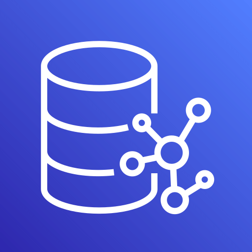

### **Amazon Aurora**

   
  

**Modelo:** PaaS
**Híbrido:** ✅
**Totalmente gerenciado pela AWS:** ✅
**Sem servidor:** ❌ (tem modo serverless opcional)
**Escopo:** Regional
**Opera:** Layer 7 – Banco de dados relacional (compatível com MySQL/PostgreSQL)
**Shared Model:**
 🔹 AWS gerencia infraestrutura, backups, replicação
 🔹 Você gerencia dados, esquemas e segurança

**Características:** Alta performance, escalabilidade, compatível SQL

**Palavras-chave:** Relacional, MySQL, PostgreSQL, alta disponibilidade

**Exemplo:** É como um banco de dados turbo que entende as mesmas linguagens do MySQL e PostgreSQL.

📝 **Como cai na prova:**
 🔹 “Precisa de banco relacional rápido e gerenciado...”
 🔹 “Qual serviço AWS é compatível com MySQL e PostgreSQL?”

💰 **Como é cobrado:**
 🔹 Por instância, armazenamento e I/O utilizados

---

### **Amazon DocumentDB**

   
  

**Modelo:** PaaS
**Híbrido:** ✅
**Totalmente gerenciado pela AWS:** ✅
**Sem servidor:** ❌
**Escopo:** Regional
**Opera:** Layer 7 – Banco NoSQL baseado em documentos (compatível MongoDB)
**Shared Model:**
 🔹 AWS gerencia a infraestrutura e replicação
 🔹 Você gerencia dados e segurança

**Características:** Banco de documentos, alta escalabilidade, compatível MongoDB

**Palavras-chave:** NoSQL, documentos, MongoDB, escalável

**Exemplo:** É como um caderno digital que guarda informações no formato de documentos, rápido e fácil de acessar.

📝 **Como cai na prova:**
 🔹 “Precisa de banco NoSQL para documentos JSON...”
 🔹 “Qual serviço é compatível com MongoDB gerenciado?”

💰 **Como é cobrado:**
 🔹 Por instância, armazenamento e I/O usados

---

### **Amazon DynamoDB**

   
  

**Modelo:** PaaS
**Híbrido:** ✅
**Totalmente gerenciado pela AWS:** ✅
**Sem servidor:** ✅
**Escopo:** Regional
**Opera:** Layer 7 – Banco NoSQL chave-valor e documento
**Shared Model:**
 🔹 AWS gerencia tudo: infraestrutura, replicação, escalabilidade
 🔹 Você gerencia tabelas, dados e permissões

**Características:** Ultra rápido, escalável, sem servidor, baixa latência

**Palavras-chave:** NoSQL, serverless, chave-valor, alta performance

**Exemplo:** É como um armário mágico que guarda e acha suas coisas num piscar de olhos, sem precisar se preocupar com servidor.

📝 **Como cai na prova:**
 🔹 “Quer banco NoSQL serverless com alta performance...”
 🔹 “Qual serviço oferece banco chave-valor totalmente gerenciado?”

💰 **Como é cobrado:**
 🔹 Por capacidade provisionada (RCU/WCU) e armazenamento

---

### **Amazon ElastiCache**

   
  

**Modelo:** PaaS
**Híbrido:** ✅
**Totalmente gerenciado pela AWS:** ✅
**Sem servidor:** ❌
**Escopo:** Regional
**Opera:** Layer 7 – Cache em memória para acelerar aplicações
**Shared Model:**
 🔹 AWS gerencia infraestrutura, replicação e failover
 🔹 Você gerencia dados em cache e permissões

**Características:** Cache rápido, suporta Redis e Memcached

**Palavras-chave:** Cache, in-memory, performance, Redis

**Exemplo:** É como uma memória rápida extra para o seu computador, que ajuda o site a responder mais rápido.

📝 **Como cai na prova:**
 🔹 “Quer melhorar a performance usando cache em memória...”
 🔹 “Qual serviço oferece cache Redis gerenciado?”

💰 **Como é cobrado:**
 🔹 Por instância e tempo usado

---

### **Amazon Neptune**

   
  

**Modelo:** PaaS
**Híbrido:** ✅
**Totalmente gerenciado pela AWS:** ✅
**Sem servidor:** ❌
**Escopo:** Regional
**Opera:** Layer 7 – Banco de grafos para dados altamente conectados
**Shared Model:**
 🔹 AWS gerencia infraestrutura e backups
 🔹 Você gerencia dados e consultas

**Características:** Banco de grafos, consultas complexas em grafos, alta disponibilidade

**Palavras-chave:** Grafo, dados conectados, consultas complexas

**Exemplo:** É como um mapa onde você pode ligar pontos e ver todas as conexões entre eles.

📝 **Como cai na prova:**
 🔹 “Quer banco para dados que têm muitas conexões...”
 🔹 “Qual serviço é banco de grafos gerenciado?”

💰 **Como é cobrado:**
 🔹 Por instância, armazenamento e I/O

---

### **Amazon RDS**

   
  

**Modelo:** PaaS
**Híbrido:** ✅
**Totalmente gerenciado pela AWS:** ✅
**Sem servidor:** ❌ (tem modo serverless opcional)
**Escopo:** Regional
**Opera:** Layer 7 – Banco relacional gerenciado (MySQL, PostgreSQL, SQL Server, etc)
**Shared Model:**
 🔹 AWS gerencia infraestrutura, backups, patches
 🔹 Você gerencia dados e segurança

**Características:** Fácil uso, escalável, backups automáticos

**Palavras-chave:** Relacional, SQL, gerenciado, banco de dados

**Exemplo:** É como um banco de dados tradicional que a AWS cuida para você não precisar se preocupar com manutenção.

📝 **Como cai na prova:**
 🔹 “Quer banco relacional gerenciado para vários motores...”
 🔹 “Qual serviço facilita bancos SQL comuns?”

💰 **Como é cobrado:**
 🔹 Por instância, armazenamento e I/O
