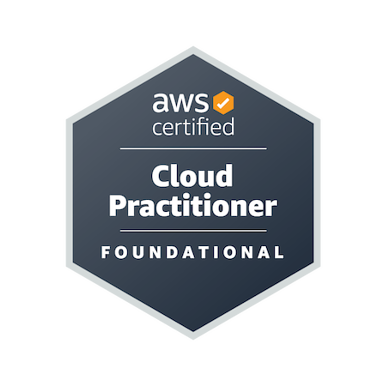

   
  <h3>AWS-Cloud-Practitioner-CLF-C02</h3>

 

**Site que usei para referência de algumas descrições e imagens: https://aws-icons.com/** 

## Sumário 📝

- [Guia Oficial do Exame](https://d1.awsstatic.com/pt_BR/training-and-certification/docs-cloud-practitioner/AWS-Certified-Cloud-Practitioner_Exam-Guide.pdf)

- [Analytics](https://github.com/andrrade/AWS-Cloud-Practitioner-CLF-C02/tree/main/01-Analytics)  
  - [Amazon Athena](https://github.com/andrrade/AWS-Cloud-Practitioner-CLF-C02/blob/main/01-Analytics/README.md#amazon-athena)
  - [Amazon EMR ](https://github.com/andrrade/AWS-Cloud-Practitioner-CLF-C02/blob/main/01-Analytics/README.md#amazon-emr)
  - [AWS Glue](https://github.com/andrrade/AWS-Cloud-Practitioner-CLF-C02/blob/main/01-Analytics/README.md#aws-glue)
  - [Amazon Kinesis](https://github.com/andrrade/AWS-Cloud-Practitioner-CLF-C02/blob/main/01-Analytics/README.md#amazon-kinesis) 
  - [Amazon OpenSearch Service](https://github.com/andrrade/AWS-Cloud-Practitioner-CLF-C02/blob/main/01-Analytics/README.md#amazon-opensearch-service) 
  - [Amazon QuickSight](https://github.com/andrrade/AWS-Cloud-Practitioner-CLF-C02/blob/main/01-Analytics/README.md#amazon-quicksight)
  - [Amazon Redshift](https://github.com/andrrade/AWS-Cloud-Practitioner-CLF-C02/blob/main/01-Analytics/README.md#amazon-redshift)

- [Integração de aplicações](https://github.com/andrrade/AWS-Cloud-Practitioner-CLF-C02/tree/main/02-Integracao-de-aplicacoes)  
  - [Amazon EventBridge](https://github.com/andrrade/AWS-Cloud-Practitioner-CLF-C02/tree/main/02-Integracao-de-aplicacoes#amazon-eventbridge)
  - [Amazon Simple Notification Service (Amazon SNS)](https://github.com/andrrade/AWS-Cloud-Practitioner-CLF-C02/tree/main/02-Integracao-de-aplicacoes#amazon-simple-notification-service-sns)
  - [Amazon Simple Queue Service (Amazon SQS) ](https://github.com/andrrade/AWS-Cloud-Practitioner-CLF-C02/tree/main/02-Integracao-de-aplicacoes#amazon-simple-queue-service-sqs)
  - [AWS Step Functions](https://github.com/andrrade/AWS-Cloud-Practitioner-CLF-C02/tree/main/02-Integracao-de-aplicacoes#aws-step-functions)  

- [Aplicações empresariais](https://github.com/andrrade/AWS-Cloud-Practitioner-CLF-C02/tree/main/03-Aplica%C3%A7oes-empresariais)  
  - [Amazon Connect](https://github.com/andrrade/AWS-Cloud-Practitioner-CLF-C02/tree/main/03-Aplica%C3%A7oes-empresariais#amazon-connect)
  - [Amazon Simple Email Service (Amazon SES)](https://github.com/andrrade/AWS-Cloud-Practitioner-CLF-C02/tree/main/03-Aplica%C3%A7oes-empresariais#amazon-simple-email-service-amazon-ses)  

- [Gerenciamento financeiro da nuvem](https://github.com/andrrade/AWS-Cloud-Practitioner-CLF-C02/tree/main/04-Gerenciamento-financeiro-da-nuvem)  
  - [AWS Budgets](https://github.com/andrrade/AWS-Cloud-Practitioner-CLF-C02/tree/main/04-Gerenciamento-financeiro-da-nuvem#aws-budgets)
  - [Relatórios de custo e uso da AWS (AWS Cost and Usage Report - CUR)](https://github.com/andrrade/AWS-Cloud-Practitioner-CLF-C02/tree/main/04-Gerenciamento-financeiro-da-nuvem#relat%C3%B3rios-de-custo-e-uso-da-aws-aws-cost-and-usage-report---cur)
  - [AWS Cost Explorer](https://github.com/andrrade/AWS-Cloud-Practitioner-CLF-C02/tree/main/04-Gerenciamento-financeiro-da-nuvem#aws-cost-explorer)
  - [AWS Marketplace](https://github.com/andrrade/AWS-Cloud-Practitioner-CLF-C02/tree/main/04-Gerenciamento-financeiro-da-nuvem#aws-marketplace)

- [Computação](https://github.com/andrrade/AWS-Cloud-Practitioner-CLF-C02/tree/main/05-Computacao)
  - [AWS Batch](https://github.com/andrrade/AWS-Cloud-Practitioner-CLF-C02/tree/main/05-Computacao#aws-batch)
  - [Amazon EC2](https://github.com/andrrade/AWS-Cloud-Practitioner-CLF-C02/tree/main/05-Computacao#amazon-ec2)
  - [AWS Elastic Beanstalk](https://github.com/andrrade/AWS-Cloud-Practitioner-CLF-C02/tree/main/05-Computacao#aws-elastic-beanstalk)
  - [Amazon Lightsail](https://github.com/andrrade/AWS-Cloud-Practitioner-CLF-C02/tree/main/05-Computacao#amazon-lightsail)
  - [AWS Outposts](https://github.com/andrrade/AWS-Cloud-Practitioner-CLF-C02/tree/main/05-Computacao#aws-outposts)

- [Contêineres](https://github.com/andrrade/AWS-Cloud-Practitioner-CLF-C02/tree/main/06-Conteineres)  
  - [Amazon Elastic Container Registry (Amazon ECR)](https://github.com/andrrade/AWS-Cloud-Practitioner-CLF-C02/tree/main/06-Conteineres#amazon-elastic-container-registry-amazon-ecr)
  - [Amazon Elastic Container Service (Amazon ECS)](https://github.com/andrrade/AWS-Cloud-Practitioner-CLF-C02/tree/main/06-Conteineres#amazon-elastic-container-service-amazon-ecs)
  - [Amazon Elastic Kubernetes Service (Amazon EKS)](https://github.com/andrrade/AWS-Cloud-Practitioner-CLF-C02/tree/main/06-Conteineres#amazon-elastic-kubernetes-service-amazon-eks)

- [Capacitação de clientes](https://github.com/andrrade/AWS-Cloud-Practitioner-CLF-C02/tree/main/07-Capacitacao-de-clientes)  
  - [AWS Support](https://github.com/andrrade/AWS-Cloud-Practitioner-CLF-C02/tree/main/07-Capacitacao-de-clientes#aws-support)

- [Banco de dados](https://github.com/andrrade/AWS-Cloud-Practitioner-CLF-C02/tree/main/08-Banco-de-dados)  
  - [Amazon Aurora](https://github.com/andrrade/AWS-Cloud-Practitioner-CLF-C02/tree/main/08-Banco-de-dados#amazon-aurora)
  - [Amazon DocumentDB](https://github.com/andrrade/AWS-Cloud-Practitioner-CLF-C02/tree/main/08-Banco-de-dados#amazon-documentdb)
  - [Amazon DynamoDB](https://github.com/andrrade/AWS-Cloud-Practitioner-CLF-C02/tree/main/08-Banco-de-dados#amazon-dynamodb)
  - [Amazon ElastiCache](https://github.com/andrrade/AWS-Cloud-Practitioner-CLF-C02/tree/main/08-Banco-de-dados#amazon-elasticache)
  - [Amazon Neptune](https://github.com/andrrade/AWS-Cloud-Practitioner-CLF-C02/tree/main/08-Banco-de-dados#amazon-neptune)
  - [Amazon RDS](https://github.com/andrrade/AWS-Cloud-Practitioner-CLF-C02/tree/main/08-Banco-de-dados#amazon-rds)

- [Ferramentas do desenvolvedor](https://github.com/andrrade/AWS-Cloud-Practitioner-CLF-C02/tree/main/09-Ferramentas-do-desenvolvedor)  
  - [AWS CLI](https://github.com/andrrade/AWS-Cloud-Practitioner-CLF-C02/tree/main/09-Ferramentas-do-desenvolvedor#aws-cli-command-line-interface)
  - [AWS CodeBuild](https://github.com/andrrade/AWS-Cloud-Practitioner-CLF-C02/tree/main/09-Ferramentas-do-desenvolvedor#aws-codebuild)
  - [AWS CodePipeline](https://github.com/andrrade/AWS-Cloud-Practitioner-CLF-C02/tree/main/09-Ferramentas-do-desenvolvedor#aws-codepipeline)
  - [AWS X-Ray](https://github.com/andrrade/AWS-Cloud-Practitioner-CLF-C02/tree/main/09-Ferramentas-do-desenvolvedor#aws-x-ray)

- [Computação para usuário final](https://github.com/andrrade/AWS-Cloud-Practitioner-CLF-C02/tree/main/10-Computacao-para-usuario-final)  
  - [Amazon AppStream 2.0](https://github.com/andrrade/AWS-Cloud-Practitioner-CLF-C02/tree/main/10-Computacao-para-usuario-final#amazon-appstream-20)
  - [Amazon WorkSpaces](https://github.com/andrrade/AWS-Cloud-Practitioner-CLF-C02/tree/main/10-Computacao-para-usuario-final#amazon-workspaces)
  - [Amazon WorkSpaces Secure Browser](https://github.com/andrrade/AWS-Cloud-Practitioner-CLF-C02/tree/main/10-Computacao-para-usuario-final#amazon-workspaces-secure-browser)

- [Web e dispositivos móveis de frontend](https://github.com/andrrade/AWS-Cloud-Practitioner-CLF-C02/tree/main/11-Web-e-dispositivos-moveis-de-frontend)  
  - [AWS Amplify](https://github.com/andrrade/AWS-Cloud-Practitioner-CLF-C02/tree/main/11-Web-e-dispositivos-moveis-de-frontend#aws-amplify)
  - [AWS AppSync](https://github.com/andrrade/AWS-Cloud-Practitioner-CLF-C02/tree/main/11-Web-e-dispositivos-moveis-de-frontend#aws-appsync)

- [Internet das Coisas (IoT)](https://github.com/andrrade/AWS-Cloud-Practitioner-CLF-C02/tree/main/12-Internet-das-Coisas-(IoT))  
  - [AWS IoT Core](https://github.com/andrrade/AWS-Cloud-Practitioner-CLF-C02/tree/main/12-Internet-das-Coisas-(IoT)#aws-iot-core)

- [Machine learning](https://github.com/andrrade/AWS-Cloud-Practitioner-CLF-C02/tree/main/13-Machine-learning)  
  - [Amazon Comprehend](https://github.com/andrrade/AWS-Cloud-Practitioner-CLF-C02/tree/main/13-Machine-learning#amazon-comprehend)
  - [Amazon Kendra](https://github.com/andrrade/AWS-Cloud-Practitioner-CLF-C02/tree/main/13-Machine-learning#amazon-kendra)
  - [Amazon Lex](https://github.com/andrrade/AWS-Cloud-Practitioner-CLF-C02/tree/main/13-Machine-learning#amazon-lex)
  - [Amazon Polly](https://github.com/andrrade/AWS-Cloud-Practitioner-CLF-C02/tree/main/13-Machine-learning#amazon-polly)
  - [Amazon Rekognition](https://github.com/andrrade/AWS-Cloud-Practitioner-CLF-C02/tree/main/13-Machine-learning#amazon-rekognition)
  - [Amazon SageMaker IA](https://github.com/andrrade/AWS-Cloud-Practitioner-CLF-C02/tree/main/13-Machine-learning#amazon-sagemaker-ia)
  - [Amazon Textract](https://github.com/andrrade/AWS-Cloud-Practitioner-CLF-C02/tree/main/13-Machine-learning#amazon-textract)
  - [Amazon Transcribe](https://github.com/andrrade/AWS-Cloud-Practitioner-CLF-C02/tree/main/13-Machine-learning#amazon-transcribe)
  - [Amazon Translate](https://github.com/andrrade/AWS-Cloud-Practitioner-CLF-C02/tree/main/13-Machine-learning#amazon-translate)

- [Gerenciamento e governança](https://github.com/andrrade/AWS-Cloud-Practitioner-CLF-C02/tree/main/14-Gerenciamento-e-governanca)  
  - [AWS Auto Scaling](https://github.com/andrrade/AWS-Cloud-Practitioner-CLF-C02/tree/main/14-Gerenciamento-e-governanca#aws-auto-scaling)
  - [AWS CloudFormation](https://github.com/andrrade/AWS-Cloud-Practitioner-CLF-C02/tree/main/14-Gerenciamento-e-governanca#aws-cloudformation)
  - [AWS CloudTrail](https://github.com/andrrade/AWS-Cloud-Practitioner-CLF-C02/tree/main/14-Gerenciamento-e-governanca#aws-cloudtrail)
  - [Amazon CloudWatch](https://github.com/andrrade/AWS-Cloud-Practitioner-CLF-C02/tree/main/14-Gerenciamento-e-governanca#amazon-cloudwatch)
  - [AWS Compute Optimizer](https://github.com/andrrade/AWS-Cloud-Practitioner-CLF-C02/tree/main/14-Gerenciamento-e-governanca#aws-compute-optimizer)
  - [AWS Config](https://github.com/andrrade/AWS-Cloud-Practitioner-CLF-C02/tree/main/14-Gerenciamento-e-governanca#aws-config)
  - [AWS Control Tower](https://github.com/andrrade/AWS-Cloud-Practitioner-CLF-C02/tree/main/14-Gerenciamento-e-governanca#aws-control-tower)
  - [AWS Health Dashboard](https://github.com/andrrade/AWS-Cloud-Practitioner-CLF-C02/tree/main/14-Gerenciamento-e-governanca#aws-health-dashboard)
  - [AWS License Manager](https://github.com/andrrade/AWS-Cloud-Practitioner-CLF-C02/tree/main/14-Gerenciamento-e-governanca#aws-license-manager)
  - [Console de Gerenciamento da AWS (Management Console)](https://github.com/andrrade/AWS-Cloud-Practitioner-CLF-C02/tree/main/14-Gerenciamento-e-governanca#console-de-gerenciamento-da-aws-management-console)
  - [AWS Organizations](https://github.com/andrrade/AWS-Cloud-Practitioner-CLF-C02/tree/main/14-Gerenciamento-e-governanca#aws-organizations)
  - [AWS Service Catalog](https://github.com/andrrade/AWS-Cloud-Practitioner-CLF-C02/tree/main/14-Gerenciamento-e-governanca#service-catalog)
  - [Service Quotas](https://github.com/andrrade/AWS-Cloud-Practitioner-CLF-C02/tree/main/14-Gerenciamento-e-governanca#service-quotas)
  - [AWS Systems Manager](https://github.com/andrrade/AWS-Cloud-Practitioner-CLF-C02/tree/main/14-Gerenciamento-e-governanca#aws-systems-manager)
  - [AWS Trusted Advisor](https://github.com/andrrade/AWS-Cloud-Practitioner-CLF-C02/tree/main/14-Gerenciamento-e-governanca#aws-trusted-advisor)
  - [AWS Well-Architected Tool](https://github.com/andrrade/AWS-Cloud-Practitioner-CLF-C02/tree/main/14-Gerenciamento-e-governanca#aws-well-architected-tool)

- [Migração e transferência](https://github.com/andrrade/AWS-Cloud-Practitioner-CLF-C02/tree/main/15-Migracao-e-transferencia)  
  - [AWS Application Discovery Service](https://github.com/andrrade/AWS-Cloud-Practitioner-CLF-C02/tree/main/15-Migracao-e-transferencia#aws-application-discovery-service)
  - [AWS Application Migration Service](https://github.com/andrrade/AWS-Cloud-Practitioner-CLF-C02/tree/main/15-Migracao-e-transferencia#aws-application-migration-service)
  - [AWS Database Migration Service (AWS DMS)](https://github.com/andrrade/AWS-Cloud-Practitioner-CLF-C02/tree/main/15-Migracao-e-transferencia#aws-database-migration-service-aws-dms)
  - [Migration Evaluator](https://github.com/andrrade/AWS-Cloud-Practitioner-CLF-C02/tree/main/15-Migracao-e-transferencia#migration-evaluator)
  - [AWS Migration Hub](https://github.com/andrrade/AWS-Cloud-Practitioner-CLF-C02/tree/main/15-Migracao-e-transferencia#aws-migration-hub)
  - [AWS Schema Conversion Tool (AWS SCT)](https://github.com/andrrade/AWS-Cloud-Practitioner-CLF-C02/tree/main/15-Migracao-e-transferencia#aws-schema-conversion-tool-aws-sct)
  - [Família AWS Snow](https://github.com/andrrade/AWS-Cloud-Practitioner-CLF-C02/tree/main/15-Migracao-e-transferencia#fam%C3%ADlia-aws-snow-snowball-snowcone-snowmobile-e-snowedge)

- [Redes e entrega de conteúdo](https://github.com/andrrade/AWS-Cloud-Practitioner-CLF-C02/tree/main/16-Redes-e-entrega-de-conteudo)  
  - [Amazon API Gateway](https://github.com/andrrade/AWS-Cloud-Practitioner-CLF-C02/tree/main/16-Redes-e-entrega-de-conteudo#amazon-api-gateway)
  - [Amazon CloudFront](https://github.com/andrrade/AWS-Cloud-Practitioner-CLF-C02/tree/main/16-Redes-e-entrega-de-conteudo#amazon-cloudfront)
  - [AWS Direct Connect](https://github.com/andrrade/AWS-Cloud-Practitioner-CLF-C02/tree/main/16-Redes-e-entrega-de-conteudo#aws-direct-connect)
  - [AWS Global Accelerator](https://github.com/andrrade/AWS-Cloud-Practitioner-CLF-C02/tree/main/16-Redes-e-entrega-de-conteudo#aws-global-accelerator)
  - [AWS PrivateLink](https://github.com/andrrade/AWS-Cloud-Practitioner-CLF-C02/tree/main/16-Redes-e-entrega-de-conteudo#aws-privatelink)
  - [Amazon Route 53](https://github.com/andrrade/AWS-Cloud-Practitioner-CLF-C02/tree/main/16-Redes-e-entrega-de-conteudo#amazon-route-53)
  - [AWS Transit Gateway](https://github.com/andrrade/AWS-Cloud-Practitioner-CLF-C02/tree/main/16-Redes-e-entrega-de-conteudo#aws-transit-gateway)
  - [Amazon VPC](https://github.com/andrrade/AWS-Cloud-Practitioner-CLF-C02/tree/main/16-Redes-e-entrega-de-conteudo#amazon-vpc)
  - [AWS Site-to-Site VPN](https://github.com/andrrade/AWS-Cloud-Practitioner-CLF-C02/tree/main/16-Redes-e-entrega-de-conteudo#aws-site-to-site-vpn)
  - [AWS Client VPN](https://github.com/andrrade/AWS-Cloud-Practitioner-CLF-C02/tree/main/16-Redes-e-entrega-de-conteudo#aws-client-vpn)

- [Segurança, identidade e conformidade](https://github.com/andrrade/AWS-Cloud-Practitioner-CLF-C02/tree/main/17-Seguranca-identidade-e-conformidade)  
  - [AWS Artifact](https://github.com/andrrade/AWS-Cloud-Practitioner-CLF-C02/tree/main/17-Seguranca-identidade-e-conformidade#aws-artifact)
  - [AWS Audit Manager](https://github.com/andrrade/AWS-Cloud-Practitioner-CLF-C02/tree/main/17-Seguranca-identidade-e-conformidade#aws-audit-manager)
  - [AWS Certificate Manager (ACM)](https://github.com/andrrade/AWS-Cloud-Practitioner-CLF-C02/tree/main/17-Seguranca-identidade-e-conformidade#aws-certificate-manager-acm)
  - [AWS CloudHSM](https://github.com/andrrade/AWS-Cloud-Practitioner-CLF-C02/tree/main/17-Seguranca-identidade-e-conformidade#aws-cloudhsm)
  - [Amazon Cognito](https://github.com/andrrade/AWS-Cloud-Practitioner-CLF-C02/tree/main/17-Seguranca-identidade-e-conformidade#amazon-cognito)
  - [Amazon Detective](https://github.com/andrrade/AWS-Cloud-Practitioner-CLF-C02/tree/main/17-Seguranca-identidade-e-conformidade#amazon-detective)
  - [AWS Directory Service](https://github.com/andrrade/AWS-Cloud-Practitioner-CLF-C02/tree/main/17-Seguranca-identidade-e-conformidade#aws-directory-service)
  - [AWS Firewall Manager](https://github.com/andrrade/AWS-Cloud-Practitioner-CLF-C02/tree/main/17-Seguranca-identidade-e-conformidade#aws-firewall-manager)
  - [Amazon GuardDuty](https://github.com/andrrade/AWS-Cloud-Practitioner-CLF-C02/tree/main/17-Seguranca-identidade-e-conformidade#amazon-guardduty)
  - [AWS Identity and Access Management (AWS IAM)](https://github.com/andrrade/AWS-Cloud-Practitioner-CLF-C02/tree/main/17-Seguranca-identidade-e-conformidade#aws-identity-and-access-management-aws-iam)
  - [Centro de Identidade do AWS IAM](https://github.com/andrrade/AWS-Cloud-Practitioner-CLF-C02/tree/main/17-Seguranca-identidade-e-conformidade#centro-de-identidade-do-aws-iam-iam-identity-center)
  - [Amazon Inspector](https://github.com/andrrade/AWS-Cloud-Practitioner-CLF-C02/tree/main/17-Seguranca-identidade-e-conformidade#amazon-inspector)
  - [AWS Key Management Service (AWS KMS)](https://github.com/andrrade/AWS-Cloud-Practitioner-CLF-C02/tree/main/17-Seguranca-identidade-e-conformidade#aws-key-management-service-aws-kms)
  - [Amazon Macie](https://github.com/andrrade/AWS-Cloud-Practitioner-CLF-C02/tree/main/17-Seguranca-identidade-e-conformidade#amazon-macie)
  - [AWS Resource Access Manager (AWS RAM)](https://github.com/andrrade/AWS-Cloud-Practitioner-CLF-C02/tree/main/17-Seguranca-identidade-e-conformidade#aws-resource-access-manager-aws-ram)
  - [AWS Secrets Manager](https://github.com/andrrade/AWS-Cloud-Practitioner-CLF-C02/tree/main/17-Seguranca-identidade-e-conformidade#aws-secrets-manager)
  - [AWS Security Hub](https://github.com/andrrade/AWS-Cloud-Practitioner-CLF-C02/tree/main/17-Seguranca-identidade-e-conformidade#aws-security-hub)
  - [AWS Shield](https://github.com/andrrade/AWS-Cloud-Practitioner-CLF-C02/tree/main/17-Seguranca-identidade-e-conformidade#aws-shield)
  - [AWS WAF](https://github.com/andrrade/AWS-Cloud-Practitioner-CLF-C02/tree/main/17-Seguranca-identidade-e-conformidade#aws-waf)

- [Sem servidor](https://github.com/andrrade/AWS-Cloud-Practitioner-CLF-C02/tree/main/18-Sem-servidor)  
  - [AWS Fargate](https://github.com/andrrade/AWS-Cloud-Practitioner-CLF-C02/tree/main/18-Sem-servidor#aws-fargate)
  - [AWS Lambda](https://github.com/andrrade/AWS-Cloud-Practitioner-CLF-C02/tree/main/18-Sem-servidor#aws-lambda)

- [Armazenamento](https://github.com/andrrade/AWS-Cloud-Practitioner-CLF-C02/tree/main/19-Armazenamento)  
  - [AWS Backup](https://github.com/andrrade/AWS-Cloud-Practitioner-CLF-C02/tree/main/19-Armazenamento#aws-backup)
  - [Amazon Elastic Block Store (Amazon EBS)](https://github.com/andrrade/AWS-Cloud-Practitioner-CLF-C02/tree/main/19-Armazenamento#amazon-elastic-block-store-amazon-ebs)
  - [Amazon Elastic File System (Amazon EFS)](https://github.com/andrrade/AWS-Cloud-Practitioner-CLF-C02/tree/main/19-Armazenamento#amazon-elastic-file-system-amazon-efs)
  - [AWS Elastic Disaster Recovery](https://github.com/andrrade/AWS-Cloud-Practitioner-CLF-C02/tree/main/19-Armazenamento#aws-elastic-disaster-recovery)
  - [Amazon FSx](https://github.com/andrrade/AWS-Cloud-Practitioner-CLF-C02/tree/main/19-Armazenamento#amazon-fsx)
  - [Amazon S3](https://github.com/andrrade/AWS-Cloud-Practitioner-CLF-C02/tree/main/19-Armazenamento#amazon-s3)
  - [Amazon S3 Glacier](https://github.com/andrrade/AWS-Cloud-Practitioner-CLF-C02/tree/main/19-Armazenamento#amazon-s3-glacier)
  - [AWS Storage Gateway](https://github.com/andrrade/AWS-Cloud-Practitioner-CLF-C02/tree/main/19-Armazenamento#aws-storage-gateway)
